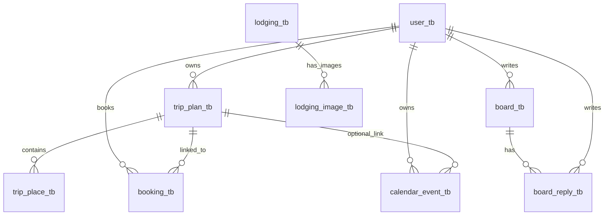

# 여행 플랫폼 DB 설계서 (상세 ERD)

- 문서 버전: `v1.0`
- 작성일: `2026-03-05`
- 기준 코드: `src/main/java/com/example/travel_platform`
- 기준 SQL: `src/main/resources/db/mapdata.sql`, `src/main/resources/db/mysql-init.sql`

## 1. 설계 범위

본 문서는 아래 2개 범위를 함께 다룬다.

1. JPA 엔티티 기반 핵심 테이블
- `user_tb`, `trip_plan_tb`, `trip_place_tb`, `board_tb`, `board_reply_tb`, `booking_tb`, `calendar_event_tb`

2. SQL 전용 보조 테이블
- `map_place_image_tb`, `lodging_tb`, `lodging_image_tb`

## 2. 설계 원칙

1. 도메인 주체는 `user_tb`이며 주요 업무 데이터는 사용자 FK를 통해 소유권을 가진다.
2. 여행 계획(`trip_plan_tb`)은 일정/예약/여행지의 허브 역할을 한다.
3. 게시판(`board_tb`)과 댓글(`board_reply_tb`)은 작성자 추적이 가능한 구조를 유지한다.
4. 지도/숙소 보조 데이터는 핵심 도메인과 느슨하게 결합한다.
5. FK로 참조 무결성을 우선 확보하고, 조회 성능은 인덱스로 보완한다.

## 3. 논리 ERD (도메인 관계)



- `map_place_image_tb`는 현재 FK 연결 없이 독립적으로 운영되는 이미지 캐시 테이블이다.

## 4. 물리 ERD (컬럼/키 포함)

```mermaid
erDiagram
    user_tb {
      INT id PK
      VARCHAR username UK
      VARCHAR password
      VARCHAR email
      DATETIME created_at
    }

    trip_plan_tb {
      INT id PK
      INT user_id FK
      VARCHAR title
      DATE start_date
      DATE end_date
      DATETIME created_at
    }

    trip_place_tb {
      INT id PK
      INT trip_plan_id FK
      VARCHAR place_name
      VARCHAR address NULL
      DECIMAL latitude NULL
      DECIMAL longitude NULL
      INT day_order
    }

    board_tb {
      INT id PK
      INT user_id FK
      VARCHAR title
      CLOB content
      INT view_count
      DATETIME created_at
    }

    board_reply_tb {
      INT id PK
      INT board_id FK
      INT user_id FK
      CLOB content
      DATETIME created_at
    }

    booking_tb {
      INT id PK
      INT user_id FK
      INT trip_plan_id FK
      VARCHAR lodging_name
      DATE check_in
      DATE check_out
      INT guest_count
      INT total_price
      DATETIME created_at
    }

    calendar_event_tb {
      INT id PK
      INT user_id FK
      INT trip_plan_id FK NULL
      VARCHAR title
      DATETIME start_at
      DATETIME end_at
      VARCHAR event_type
    }

    map_place_image_tb {
      BIGINT id PK
      VARCHAR normalized_name UK
      VARCHAR place_name
      VARCHAR image_url
      VARCHAR source
      DATETIME created_at
    }

    lodging_tb {
      BIGINT id PK
      VARCHAR external_place_id UK
      VARCHAR name
      VARCHAR normalized_name
      VARCHAR category_group_code
      VARCHAR category_name NULL
      VARCHAR phone NULL
      VARCHAR address NULL
      VARCHAR road_address NULL
      VARCHAR region_key
      DECIMAL lat
      DECIMAL lng
      VARCHAR place_url NULL
      INT room_price
      INT fee
      BOOLEAN is_active
      DATETIME created_at
      DATETIME updated_at
    }

    lodging_image_tb {
      BIGINT id PK
      BIGINT lodging_id FK
      VARCHAR image_url
      VARCHAR image_type
      INT sort_order
      VARCHAR source
      BOOLEAN is_active
      DATETIME created_at
    }

    user_tb ||--o{ trip_plan_tb : user_id
    trip_plan_tb ||--o{ trip_place_tb : trip_plan_id
    user_tb ||--o{ board_tb : user_id
    board_tb ||--o{ board_reply_tb : board_id
    user_tb ||--o{ board_reply_tb : user_id
    user_tb ||--o{ booking_tb : user_id
    trip_plan_tb ||--o{ booking_tb : trip_plan_id
    user_tb ||--o{ calendar_event_tb : user_id
    trip_plan_tb ||--o{ calendar_event_tb : trip_plan_id
    lodging_tb ||--o{ lodging_image_tb : lodging_id
```

## 5. 관계 상세(카디널리티/선택성)

| 부모 테이블 | 자식 테이블 | 카디널리티 | 자식 FK NULL | 의미 |
| --- | --- | --- | --- | --- |
| `user_tb` | `trip_plan_tb` | 1:N | 불가 | 한 사용자는 여러 여행계획 소유 가능 |
| `trip_plan_tb` | `trip_place_tb` | 1:N | 불가 | 한 여행계획은 여러 장소 보유 |
| `user_tb` | `board_tb` | 1:N | 불가 | 한 사용자는 여러 게시글 작성 가능 |
| `board_tb` | `board_reply_tb` | 1:N | 불가 | 한 게시글은 여러 댓글 보유 |
| `user_tb` | `board_reply_tb` | 1:N | 불가 | 한 사용자는 여러 댓글 작성 가능 |
| `user_tb` | `booking_tb` | 1:N | 불가 | 한 사용자는 여러 예약 보유 가능 |
| `trip_plan_tb` | `booking_tb` | 1:N | 불가 | 한 여행계획에 여러 예약 연결 가능 |
| `user_tb` | `calendar_event_tb` | 1:N | 불가 | 한 사용자는 여러 일정 이벤트 보유 |
| `trip_plan_tb` | `calendar_event_tb` | 1:N | 가능 | 이벤트가 여행계획에 선택적으로 연결됨 |
| `lodging_tb` | `lodging_image_tb` | 1:N | 불가 | 한 숙소는 여러 이미지 보유 |

## 6. 키/무결성 설계

### 6.1 PK 전략

- 핵심 도메인 테이블: `INT IDENTITY/AUTO_INCREMENT`
- 보조 테이블: `BIGINT IDENTITY/AUTO_INCREMENT`

### 6.2 UK 전략

- `user_tb.username`
- `map_place_image_tb.normalized_name`
- `lodging_tb.external_place_id`
- `lodging_image_tb (lodging_id, image_url(255))` (MySQL 스크립트 기준)

### 6.3 FK 전략

- 주요 업무 흐름은 모두 FK로 연결해 무결성 보장
- `calendar_event_tb.trip_plan_id`만 선택 연결(Nullable FK)
- `map_place_image_tb`는 FK 없는 독립 캐시 테이블

### 6.4 삭제/수정 정책

- 현재 스키마에는 `ON DELETE CASCADE`/`ON UPDATE CASCADE`를 명시적으로 사용하지 않는다.
- 따라서 부모 삭제 시 자식 데이터 처리 정책은 애플리케이션 서비스 계층에서 제어해야 한다.

## 7. 인덱스 설계

### 7.1 자동/암묵 인덱스

- PK, UK 컬럼 인덱스는 DB 엔진에서 자동 생성
- FK 컬럼은 조인 경로 기준으로 성능 점검 필요

### 7.2 명시 인덱스 (MySQL 보조 스키마)

- `lodging_tb`
  - `idx_lodging_region_active (region_key, is_active)`
  - `idx_lodging_geo (lat, lng)`
  - `idx_lodging_name (normalized_name)`
- `lodging_image_tb`
  - `idx_lodging_image_order (lodging_id, sort_order)`

## 8. 설계 검토 포인트

1. `calendar_event_tb.trip_plan_id`는 선택 FK이므로, 이벤트 단독 레코드 발생을 허용하는 정책이 맞는지 지속 검증 필요
2. `board_tb.content`, `board_reply_tb.content`는 `LOB` 타입이므로 전문 검색 요구가 생기면 검색 전용 인덱스/엔진 검토 필요
3. `booking_tb`는 기간 조회 빈도가 높아지면 `(user_id, check_in)` 등 복합 인덱스 검토 필요
4. `map_place_image_tb`는 독립 캐시 구조이므로 정합성(원본 장소명 정규화) 검증 로직이 중요

## 9. 관련 문서

- 엔티티 정의: `.docs/specs/entity-definition.md`
- 테이블 명세: `.docs/specs/table-specification.md`
