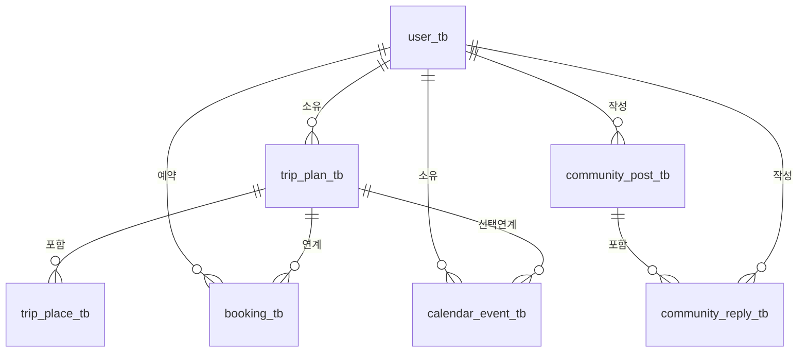

# 여행 플랫폼 엔티티 정의서

- 문서 버전: `v1.0`
- 작성일: `2026-03-04`
- 적용 범위: `src/main/java/com/example/travel_platform` 하위 JPA 엔티티
- DB 실행 환경: `H2 (jdbc:h2:mem:test)` + `Hibernate ddl-auto=create`
- 네이밍 규칙: Spring/Hibernate 기본 물리 네이밍(`camelCase` -> `snake_case`)

## 1. 엔티티 목록

| 도메인 | 엔티티 | 테이블 |
| --- | --- | --- |
| 사용자 | `User` | `user_tb` |
| 여행 | `TripPlan` | `trip_plan_tb` |
| 여행 | `TripPlace` | `trip_place_tb` |
| 커뮤니티 | `CommunityPost` | `community_post_tb` |
| 커뮤니티 | `CommunityReply` | `community_reply_tb` |
| 예약 | `Booking` | `booking_tb` |
| 캘린더 | `CalendarEvent` | `calendar_event_tb` |

## 2. 엔티티 상세 정의

### 2.1 `user_tb` (`User`)

| 컬럼명 | 타입 | NULL 허용 | 키 | 기본값 | 설명 |
| --- | --- | --- | --- | --- | --- |
| `id` | `integer` | N | PK | auto increment | 사용자 식별자 |
| `username` | `varchar(255)` | Y | UK | - | 로그인 아이디, 유니크 |
| `password` | `varchar(100)` | N | - | - | 비밀번호 |
| `email` | `varchar(255)` | Y | - | - | 이메일 |
| `created_at` | `timestamp` | Y | - | `CreationTimestamp` | 생성 시각 |

비고:
- `username`은 유니크 제약을 가짐 (`@Column(unique = true)`).
- `password`는 최대 길이 100, NOT NULL 제약을 가짐 (`@Column(length = 100, nullable = false)`).

### 2.2 `trip_plan_tb` (`TripPlan`)

| 컬럼명 | 타입 | NULL 허용 | 키 | 기본값 | 설명 |
| --- | --- | --- | --- | --- | --- |
| `id` | `integer` | N | PK | auto increment | 여행 계획 식별자 |
| `user_id` | `integer` | N | FK | - | 소유 사용자 (`user_tb.id`) |
| `title` | `varchar(100)` | N | - | - | 여행 계획 제목 |
| `start_date` | `date` | N | - | - | 여행 시작일 |
| `end_date` | `date` | N | - | - | 여행 종료일 |
| `created_at` | `timestamp` | Y | - | `CreationTimestamp` | 생성 시각 |

### 2.3 `trip_place_tb` (`TripPlace`)

| 컬럼명 | 타입 | NULL 허용 | 키 | 기본값 | 설명 |
| --- | --- | --- | --- | --- | --- |
| `id` | `integer` | N | PK | auto increment | 장소 식별자 |
| `trip_plan_id` | `integer` | N | FK | - | 상위 여행 계획 (`trip_plan_tb.id`) |
| `place_name` | `varchar(100)` | N | - | - | 장소명 |
| `address` | `varchar(255)` | Y | - | - | 주소 |
| `latitude` | `numeric(10,7)` | Y | - | - | 위도 |
| `longitude` | `numeric(10,7)` | Y | - | - | 경도 |
| `day_order` | `integer` | N | - | - | 여행 일차/순서 |

### 2.4 `community_post_tb` (`CommunityPost`)

| 컬럼명 | 타입 | NULL 허용 | 키 | 기본값 | 설명 |
| --- | --- | --- | --- | --- | --- |
| `id` | `integer` | N | PK | auto increment | 게시글 식별자 |
| `user_id` | `integer` | N | FK | - | 작성자 (`user_tb.id`) |
| `title` | `varchar(150)` | N | - | - | 게시글 제목 |
| `content` | `clob` | N | - | - | 게시글 본문 |
| `view_count` | `integer` | N | - | `0` | 조회수 |
| `created_at` | `timestamp` | Y | - | `CreationTimestamp` | 생성 시각 |

### 2.5 `community_reply_tb` (`CommunityReply`)

| 컬럼명 | 타입 | NULL 허용 | 키 | 기본값 | 설명 |
| --- | --- | --- | --- | --- | --- |
| `id` | `integer` | N | PK | auto increment | 댓글 식별자 |
| `post_id` | `integer` | N | FK | - | 상위 게시글 (`community_post_tb.id`) |
| `user_id` | `integer` | N | FK | - | 작성자 (`user_tb.id`) |
| `content` | `clob` | N | - | - | 댓글 본문 |
| `created_at` | `timestamp` | Y | - | `CreationTimestamp` | 생성 시각 |

### 2.6 `booking_tb` (`Booking`)

| 컬럼명 | 타입 | NULL 허용 | 키 | 기본값 | 설명 |
| --- | --- | --- | --- | --- | --- |
| `id` | `integer` | N | PK | auto increment | 예약 식별자 |
| `user_id` | `integer` | N | FK | - | 예약 사용자 (`user_tb.id`) |
| `trip_plan_id` | `integer` | N | FK | - | 연관 여행 계획 (`trip_plan_tb.id`) |
| `lodging_name` | `varchar(120)` | N | - | - | 숙소명 |
| `check_in` | `date` | N | - | - | 체크인 일자 |
| `check_out` | `date` | N | - | - | 체크아웃 일자 |
| `guest_count` | `integer` | N | - | - | 인원수 |
| `total_price` | `integer` | N | - | - | 총 금액 |
| `created_at` | `timestamp` | Y | - | `CreationTimestamp` | 생성 시각 |

### 2.7 `calendar_event_tb` (`CalendarEvent`)

| 컬럼명 | 타입 | NULL 허용 | 키 | 기본값 | 설명 |
| --- | --- | --- | --- | --- | --- |
| `id` | `integer` | N | PK | auto increment | 캘린더 일정 식별자 |
| `user_id` | `integer` | N | FK | - | 소유 사용자 (`user_tb.id`) |
| `trip_plan_id` | `integer` | Y | FK | - | 연관 여행 계획 (`trip_plan_tb.id`), 선택값 |
| `title` | `varchar(120)` | N | - | - | 일정 제목 |
| `start_at` | `timestamp` | N | - | - | 시작 일시 |
| `end_at` | `timestamp` | N | - | - | 종료 일시 |
| `event_type` | `varchar(50)` | N | - | - | 일정 유형(문자열) |

## 3. 관계 요약

## 4. 애플리케이션 유효성 규칙 (DTO/Service)

### 4.1 DTO 수준 제약 (구현됨)
- `UserRequest.JoinDTO`: `username`, `password`, `email` 필수, `email` 형식 검증.
- `TripRequest.CreatePlanDTO`: `title`, `startDate`, `endDate` 필수.
- `TripRequest.AddPlaceDTO`: `placeName`, `dayOrder` 필수.
- `CommunityRequest.*`: 게시글/댓글 `title`, `content` 필수.
- `BookingRequest.CreateBookingDTO`: `tripPlanId`, `lodgingName`, `checkIn`, `checkOut` 필수, `guestCount >= 1`, `totalPrice >= 0`.
- `CalendarRequest.CreateEventDTO`, `UpdateEventDTO`: `title`, `startAt`, `endAt`, `eventType` 필수 (`tripPlanId`는 생성 시 선택).

### 4.2 서비스 수준 규칙 (예정, TODO)
- `TripService`, `CommunityService`, `BookingService`, `CalendarService`의 소유권 검증/업무 규칙 검증은 대부분 TODO 상태.
- `startAt <= endAt`, 예약 중복 검증, 인가 검증 등 핵심 규칙이 아직 확정 구현되지 않음.

## 5. 현재 구현 메모

- `UserRepository`를 제외한 Repository 메서드는 대부분 TODO 스텁 상태로, 조회/정렬/페이징/삭제 정책이 미확정.
- `calendar_event_tb.event_type`에 대한 enum 또는 DB check 제약이 없음.
- JPA가 생성하는 PK/UK 외에 명시적인 인덱스 정의가 없음.
