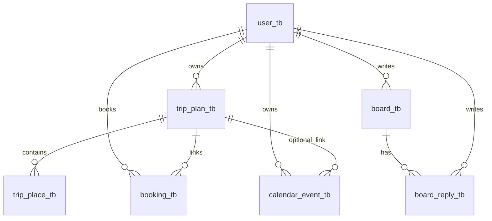

# 여행 플랫폼 엔티티 정의서

- 문서 버전: `v2.0`
- 기준일: `2026-03-05`
- 기준 코드: `src/main/java/com/example/travel_platform`
- 기준 환경: `H2 (jdbc:h2:mem:test)` + `spring.jpa.hibernate.ddl-auto=create`

## 상세 ERD 문서 안내

- 프로젝트 전체 DB 설계(보조 SQL 테이블 포함) 상세 ERD는 `.docs/specs/db-erd-design.md`를 참고한다.

## 1. 엔티티 목록 (최신)

| 도메인 | 엔티티 | 테이블 |
| --- | --- | --- |
| 사용자 | `User` | `user_tb` |
| 여행 | `TripPlan` | `trip_plan_tb` |
| 여행 | `TripPlace` | `trip_place_tb` |
| 커뮤니티 | `Board` | `board_tb` |
| 커뮤니티 | `Reply` | `board_reply_tb` |
| 예약 | `Booking` | `booking_tb` |
| 캘린더 | `CalendarEvent` | `calendar_event_tb` |

## 2. 엔티티 상세 정의

### 2.1 `User` (`user_tb`)

| 필드 | 컬럼 | 타입 | NULL | 제약 |
| --- | --- | --- | --- | --- |
| `id` | `id` | `Integer` | N | PK, IDENTITY |
| `username` | `username` | `String` | Y | UNIQUE |
| `password` | `password` | `String` | N | `length=100`, `nullable=false` |
| `email` | `email` | `String` | Y | - |
| `createdAt` | `created_at` | `LocalDateTime` | Y | `@CreationTimestamp` |

### 2.2 `TripPlan` (`trip_plan_tb`)

| 필드 | 컬럼 | 타입 | NULL | 제약 |
| --- | --- | --- | --- | --- |
| `id` | `id` | `Integer` | N | PK, IDENTITY |
| `user` | `user_id` | `User` | N | FK (`@ManyToOne`, LAZY) |
| `title` | `title` | `String` | N | `length=100` |
| `startDate` | `start_date` | `LocalDate` | N | - |
| `endDate` | `end_date` | `LocalDate` | N | - |
| `createdAt` | `created_at` | `LocalDateTime` | Y | `@CreationTimestamp` |

### 2.3 `TripPlace` (`trip_place_tb`)

| 필드 | 컬럼 | 타입 | NULL | 제약 |
| --- | --- | --- | --- | --- |
| `id` | `id` | `Integer` | N | PK, IDENTITY |
| `tripPlan` | `trip_plan_id` | `TripPlan` | N | FK (`@ManyToOne`, LAZY) |
| `placeName` | `place_name` | `String` | N | `length=100` |
| `address` | `address` | `String` | Y | `length=255` |
| `latitude` | `latitude` | `BigDecimal` | Y | `precision=10, scale=7` |
| `longitude` | `longitude` | `BigDecimal` | Y | `precision=10, scale=7` |
| `dayOrder` | `day_order` | `Integer` | N | - |

### 2.4 `Board` (`board_tb`)

| 필드 | 컬럼 | 타입 | NULL | 제약 |
| --- | --- | --- | --- | --- |
| `id` | `id` | `Integer` | N | PK, IDENTITY |
| `user` | `user_id` | `User` | N | FK (`@ManyToOne`, LAZY) |
| `title` | `title` | `String` | N | `length=150` |
| `content` | `content` | `String` | N | `@Lob` |
| `viewCount` | `view_count` | `Integer` | N | 기본값 `0` |
| `replies` | - | `List<Reply>` | - | `@OneToMany(mappedBy="board")` |
| `createdAt` | `created_at` | `LocalDateTime` | Y | `@CreationTimestamp` |

### 2.5 `Reply` (`board_reply_tb`)

| 필드 | 컬럼 | 타입 | NULL | 제약 |
| --- | --- | --- | --- | --- |
| `id` | `id` | `Integer` | N | PK, IDENTITY |
| `board` | `board_id` | `Board` | N | FK (`@ManyToOne`, LAZY) |
| `user` | `user_id` | `User` | N | FK (`@ManyToOne`, LAZY) |
| `content` | `content` | `String` | N | `@Lob` |
| `createdAt` | `created_at` | `LocalDateTime` | Y | `@CreationTimestamp` |

### 2.6 `Booking` (`booking_tb`)

| 필드 | 컬럼 | 타입 | NULL | 제약 |
| --- | --- | --- | --- | --- |
| `id` | `id` | `Integer` | N | PK, IDENTITY |
| `user` | `user_id` | `User` | N | FK (`@ManyToOne`, LAZY) |
| `tripPlan` | `trip_plan_id` | `TripPlan` | N | FK (`@ManyToOne`, LAZY) |
| `lodgingName` | `lodging_name` | `String` | N | `length=120` |
| `checkIn` | `check_in` | `LocalDate` | N | - |
| `checkOut` | `check_out` | `LocalDate` | N | - |
| `guestCount` | `guest_count` | `Integer` | N | - |
| `totalPrice` | `total_price` | `Integer` | N | - |
| `createdAt` | `created_at` | `LocalDateTime` | Y | `@CreationTimestamp` |

### 2.7 `CalendarEvent` (`calendar_event_tb`)

| 필드 | 컬럼 | 타입 | NULL | 제약 |
| --- | --- | --- | --- | --- |
| `id` | `id` | `Integer` | N | PK, IDENTITY |
| `user` | `user_id` | `User` | N | FK (`@ManyToOne`, LAZY) |
| `tripPlan` | `trip_plan_id` | `TripPlan` | Y | FK (`@ManyToOne`, LAZY) |
| `title` | `title` | `String` | N | `length=120` |
| `startAt` | `start_at` | `LocalDateTime` | N | - |
| `endAt` | `end_at` | `LocalDateTime` | N | - |
| `eventType` | `event_type` | `String` | N | `length=50` |

## 3. 관계 요약

## 4. v1.0 대비 변경 사항

- 커뮤니티 엔티티/테이블명을 `CommunityPost`/`CommunityReply` 기준에서 `Board`/`Reply` 기준으로 최신화.
  - `community_post_tb` -> `board_tb`
  - `community_reply_tb` -> `board_reply_tb`
- 현재 코드에는 `Community*` 엔티티가 존재하지 않음을 반영.
- DTO/Service 유효성 구현 상태를 엔티티 정의서에서 제거하고, 엔티티 구조 중심 문서로 정리.

## 5. 참고

- 본 문서는 JPA 엔티티 기준 문서다.
- `map_place_image_tb`, `lodging_tb` 등 JDBC 기반 보조 테이블은 `.docs/specs/table-specification.md`에서 별도 관리한다.
