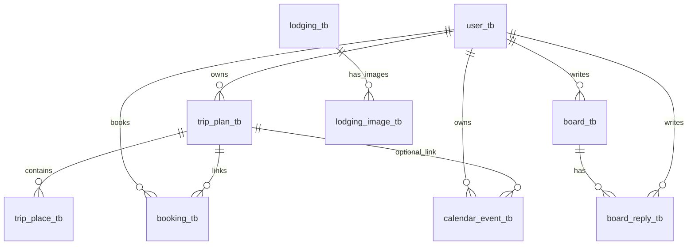
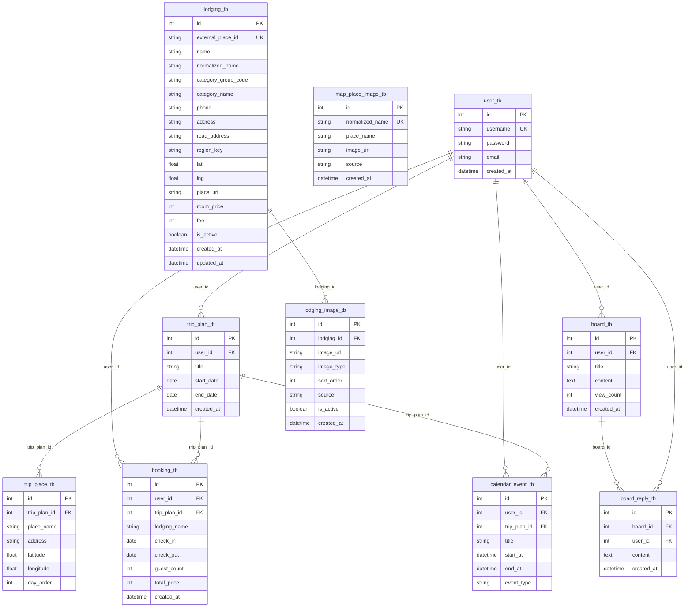

# 여행 플랫폼 테이블 명세서

- 문서 버전: `v2.0`
- 기준일: `2026-03-05`
- 기준 코드: `src/main/java/com/example/travel_platform`, `src/main/resources/db/*.sql`

## 상세 ERD 문서 안내

- 상세 DB 설계(논리/물리 ERD, 키/인덱스/무결성)는 `.docs/specs/db-erd-design.md`를 참고한다.

## 1. 스키마 생성 기준

### 1.1 기본 실행(H2, 현재 설정)

- DB: `jdbc:h2:mem:test`
- JPA: `spring.jpa.hibernate.ddl-auto=create`
- SQL 초기 데이터: `spring.sql.init.data-locations=classpath:db/data.sql`
- 결과: JPA 엔티티 기반 7개 테이블이 생성되고, `data.sql` 데이터가 적재됨.

### 1.2 보조 SQL 테이블(수동/별도 적용)

- `db/mapdata.sql`: 지도 이미지/숙소 조회용 테이블 생성 스크립트
  - `map_place_image_tb`, `lodging_tb`
- `db/mysql-init.sql`: MySQL 부트스트랩 스크립트
  - 위 2개 + `lodging_image_tb` 포함

## 2. 테이블 목록 (최신)

### 2.1 JPA 엔티티 기반(기본 런타임)

| 번호  | 테이블명                | 기준              |
| --- | ------------------- | --------------- |
| 1   | `user_tb`           | `User`          |
| 2   | `trip_plan_tb`      | `TripPlan`      |
| 3   | `trip_place_tb`     | `TripPlace`     |
| 4   | `board_tb`          | `Board`         |
| 5   | `board_reply_tb`    | `Reply`         |
| 6   | `booking_tb`        | `Booking`       |
| 7   | `calendar_event_tb` | `CalendarEvent` |

### 2.2 SQL 전용(지도/숙소 보조)

| 번호  | 테이블명                 | 기준                                    |
| --- | -------------------- | ------------------------------------- |
| 8   | `map_place_image_tb` | `db/mapdata.sql`, `db/mysql-init.sql` |
| 9   | `lodging_tb`         | `db/mapdata.sql`, `db/mysql-init.sql` |
| 10  | `lodging_image_tb`   | `db/mysql-init.sql` 전용                |

## 3. 테이블 상세 명세

### 3.1 `user_tb`

| 컬럼           | 타입             | NULL | PK  | UK  | FK  | 기본값               | 비고                   |
| ------------ | -------------- | ---- | --- | --- | --- | ----------------- | -------------------- |
| `id`         | `INTEGER`      | N    | Y   | N   | N   | identity          |                      |
| `username`   | `VARCHAR(255)` | Y    | N   | Y   | N   | -                 | JPA 기준 nullable=true |
| `password`   | `VARCHAR(100)` | N    | N   | N   | N   | -                 |                      |
| `email`      | `VARCHAR(255)` | Y    | N   | N   | N   | -                 |                      |
| `created_at` | `TIMESTAMP`    | Y    | N   | N   | N   | current timestamp | `@CreationTimestamp` |

### 3.2 `trip_plan_tb`

| 컬럼           | 타입             | NULL | PK  | UK  | FK  | 기본값               | 비고              |
| ------------ | -------------- | ---- | --- | --- | --- | ----------------- | --------------- |
| `id`         | `INTEGER`      | N    | Y   | N   | N   | identity          |                 |
| `user_id`    | `INTEGER`      | N    | N   | N   | Y   | -                 | -> `user_tb.id` |
| `title`      | `VARCHAR(100)` | N    | N   | N   | N   | -                 |                 |
| `start_date` | `DATE`         | N    | N   | N   | N   | -                 |                 |
| `end_date`   | `DATE`         | N    | N   | N   | N   | -                 |                 |
| `created_at` | `TIMESTAMP`    | Y    | N   | N   | N   | current timestamp |                 |

### 3.3 `trip_place_tb`

| 컬럼             | 타입              | NULL | PK  | UK  | FK  | 기본값      | 비고                   |
| -------------- | --------------- | ---- | --- | --- | --- | -------- | -------------------- |
| `id`           | `INTEGER`       | N    | Y   | N   | N   | identity |                      |
| `trip_plan_id` | `INTEGER`       | N    | N   | N   | Y   | -        | -> `trip_plan_tb.id` |
| `place_name`   | `VARCHAR(100)`  | N    | N   | N   | N   | -        |                      |
| `address`      | `VARCHAR(255)`  | Y    | N   | N   | N   | -        |                      |
| `latitude`     | `NUMERIC(10,7)` | Y    | N   | N   | N   | -        |                      |
| `longitude`    | `NUMERIC(10,7)` | Y    | N   | N   | N   | -        |                      |
| `day_order`    | `INTEGER`       | N    | N   | N   | N   | -        |                      |

### 3.4 `board_tb`

| 컬럼           | 타입             | NULL | PK  | UK  | FK  | 기본값               | 비고              |
| ------------ | -------------- | ---- | --- | --- | --- | ----------------- | --------------- |
| `id`         | `INTEGER`      | N    | Y   | N   | N   | identity          |                 |
| `user_id`    | `INTEGER`      | N    | N   | N   | Y   | -                 | -> `user_tb.id` |
| `title`      | `VARCHAR(150)` | N    | N   | N   | N   | -                 |                 |
| `content`    | `CLOB`         | N    | N   | N   | N   | -                 | `@Lob`          |
| `view_count` | `INTEGER`      | N    | N   | N   | N   | `0`               |                 |
| `created_at` | `TIMESTAMP`    | Y    | N   | N   | N   | current timestamp |                 |

### 3.5 `board_reply_tb`

| 컬럼           | 타입          | NULL | PK  | UK  | FK  | 기본값               | 비고               |
| ------------ | ----------- | ---- | --- | --- | --- | ----------------- | ---------------- |
| `id`         | `INTEGER`   | N    | Y   | N   | N   | identity          |                  |
| `board_id`   | `INTEGER`   | N    | N   | N   | Y   | -                 | -> `board_tb.id` |
| `user_id`    | `INTEGER`   | N    | N   | N   | Y   | -                 | -> `user_tb.id`  |
| `content`    | `CLOB`      | N    | N   | N   | N   | -                 | `@Lob`           |
| `created_at` | `TIMESTAMP` | Y    | N   | N   | N   | current timestamp |                  |

### 3.6 `booking_tb`

| 컬럼             | 타입             | NULL | PK  | UK  | FK  | 기본값               | 비고                   |
| -------------- | -------------- | ---- | --- | --- | --- | ----------------- | -------------------- |
| `id`           | `INTEGER`      | N    | Y   | N   | N   | identity          |                      |
| `user_id`      | `INTEGER`      | N    | N   | N   | Y   | -                 | -> `user_tb.id`      |
| `trip_plan_id` | `INTEGER`      | N    | N   | N   | Y   | -                 | -> `trip_plan_tb.id` |
| `lodging_name` | `VARCHAR(120)` | N    | N   | N   | N   | -                 |                      |
| `check_in`     | `DATE`         | N    | N   | N   | N   | -                 |                      |
| `check_out`    | `DATE`         | N    | N   | N   | N   | -                 |                      |
| `guest_count`  | `INTEGER`      | N    | N   | N   | N   | -                 |                      |
| `total_price`  | `INTEGER`      | N    | N   | N   | N   | -                 |                      |
| `created_at`   | `TIMESTAMP`    | Y    | N   | N   | N   | current timestamp |                      |

### 3.7 `calendar_event_tb`

| 컬럼             | 타입             | NULL | PK  | UK  | FK  | 기본값      | 비고                   |
| -------------- | -------------- | ---- | --- | --- | --- | -------- | -------------------- |
| `id`           | `INTEGER`      | N    | Y   | N   | N   | identity |                      |
| `user_id`      | `INTEGER`      | N    | N   | N   | Y   | -        | -> `user_tb.id`      |
| `trip_plan_id` | `INTEGER`      | Y    | N   | N   | Y   | -        | -> `trip_plan_tb.id` |
| `title`        | `VARCHAR(120)` | N    | N   | N   | N   | -        |                      |
| `start_at`     | `TIMESTAMP`    | N    | N   | N   | N   | -        |                      |
| `end_at`       | `TIMESTAMP`    | N    | N   | N   | N   | -        |                      |
| `event_type`   | `VARCHAR(50)`  | N    | N   | N   | N   | -        |                      |

### 3.8 `map_place_image_tb` (SQL 전용)

| 컬럼                | 타입              | NULL | PK  | UK  | 기본값               | 비고  |
| ----------------- | --------------- | ---- | --- | --- | ----------------- | --- |
| `id`              | `BIGINT`        | N    | Y   | N   | identity          |     |
| `normalized_name` | `VARCHAR(200)`  | N    | N   | Y   | -                 |     |
| `place_name`      | `VARCHAR(200)`  | N    | N   | N   | -                 |     |
| `image_url`       | `VARCHAR(2000)` | N    | N   | N   | -                 |     |
| `source`          | `VARCHAR(50)`   | N    | N   | N   | -                 |     |
| `created_at`      | `TIMESTAMP`     | N    | N   | N   | current timestamp |     |

### 3.9 `lodging_tb` (SQL 전용)

| 컬럼                    | 타입              | NULL | PK  | UK  | 기본값               | 비고  |
| --------------------- | --------------- | ---- | --- | --- | ----------------- | --- |
| `id`                  | `BIGINT`        | N    | Y   | N   | identity          |     |
| `external_place_id`   | `VARCHAR(64)`   | N    | N   | Y   | -                 |     |
| `name`                | `VARCHAR(200)`  | N    | N   | N   | -                 |     |
| `normalized_name`     | `VARCHAR(200)`  | N    | N   | N   | -                 |     |
| `category_group_code` | `VARCHAR(10)`   | N    | N   | N   | -                 |     |
| `category_name`       | `VARCHAR(300)`  | Y    | N   | N   | -                 |     |
| `phone`               | `VARCHAR(50)`   | Y    | N   | N   | -                 |     |
| `address`             | `VARCHAR(300)`  | Y    | N   | N   | -                 |     |
| `road_address`        | `VARCHAR(300)`  | Y    | N   | N   | -                 |     |
| `region_key`          | `VARCHAR(50)`   | N    | N   | N   | -                 |     |
| `lat`                 | `DECIMAL(10,7)` | N    | N   | N   | -                 |     |
| `lng`                 | `DECIMAL(10,7)` | N    | N   | N   | -                 |     |
| `place_url`           | `VARCHAR(500)`  | Y    | N   | N   | -                 |     |
| `room_price`          | `INT`           | N    | N   | N   | 0                 |     |
| `fee`                 | `INT`           | N    | N   | N   | 0                 |     |
| `is_active`           | `BOOLEAN`       | N    | N   | N   | true/1            |     |
| `created_at`          | `TIMESTAMP`     | N    | N   | N   | current timestamp |     |
| `updated_at`          | `TIMESTAMP`     | N    | N   | N   | current timestamp |     |

### 3.10 `lodging_image_tb` (MySQL 초기화 스크립트 전용)

| 컬럼           | 타입              | NULL | PK  | UK  | FK  | 기본값               | 비고                 |
| ------------ | --------------- | ---- | --- | --- | --- | ----------------- | ------------------ |
| `id`         | `BIGINT`        | N    | Y   | N   | N   | identity          |                    |
| `lodging_id` | `BIGINT`        | N    | N   | N   | Y   | -                 | -> `lodging_tb.id` |
| `image_url`  | `VARCHAR(2000)` | N    | N   | N   | N   | -                 |                    |
| `image_type` | `VARCHAR(30)`   | N    | N   | N   | N   | `INTERIOR`        |                    |
| `sort_order` | `INT`           | N    | N   | N   | N   | `0`               |                    |
| `source`     | `VARCHAR(50)`   | N    | N   | N   | N   | `MANUAL`          |                    |
| `is_active`  | `TINYINT(1)`    | N    | N   | N   | N   | `1`               |                    |
| `created_at` | `DATETIME`      | N    | N   | N   | N   | current timestamp |                    |

## 4. 관계 요약

| 부모             | 자식                  | 관계      | FK                               |
| -------------- | ------------------- | ------- | -------------------------------- |
| `user_tb`      | `trip_plan_tb`      | 1:N     | `trip_plan_tb.user_id`           |
| `trip_plan_tb` | `trip_place_tb`     | 1:N     | `trip_place_tb.trip_plan_id`     |
| `user_tb`      | `board_tb`          | 1:N     | `board_tb.user_id`               |
| `board_tb`     | `board_reply_tb`    | 1:N     | `board_reply_tb.board_id`        |
| `user_tb`      | `board_reply_tb`    | 1:N     | `board_reply_tb.user_id`         |
| `user_tb`      | `booking_tb`        | 1:N     | `booking_tb.user_id`             |
| `trip_plan_tb` | `booking_tb`        | 1:N     | `booking_tb.trip_plan_id`        |
| `user_tb`      | `calendar_event_tb` | 1:N     | `calendar_event_tb.user_id`      |
| `trip_plan_tb` | `calendar_event_tb` | 1:N(선택) | `calendar_event_tb.trip_plan_id` |
| `lodging_tb`   | `lodging_image_tb`  | 1:N     | `lodging_image_tb.lodging_id`    |

### 4.1 ERD 다이어그램 (프로젝트 기준)

- `map_place_image_tb`는 현재 스키마에서 다른 테이블과 FK로 연결되지 않는 독립 테이블이다.

### 4.2 ERD 다이어그램

- `trip_plan_id` in `calendar_event_tb`는 선택 FK(Nullable)다.
- 상세 관계/무결성/인덱스 설명은 `.docs/specs/db-erd-design.md`를 참고한다.

## 5. v1.0 대비 변경 사항

- 커뮤니티 테이블명을 최신 코드 기준으로 정정.
  - `community_post_tb` -> `board_tb`
  - `community_reply_tb` -> `board_reply_tb`
- SQL 전용 보조 테이블(`map_place_image_tb`, `lodging_tb`, `lodging_image_tb`) 명세 추가.
- 실제 기본 실행 설정(`data.sql`만 로드)을 반영해 스키마 적용 범위를 구분.

## 6. 주의사항

- 현재 기본 실행 설정에서는 `mapdata.sql`이 자동 실행되지 않는다.
- 따라서 지도/숙소 보조 API를 사용하려면 별도 테이블 준비가 필요하다.
