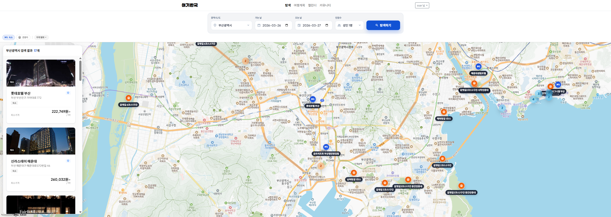
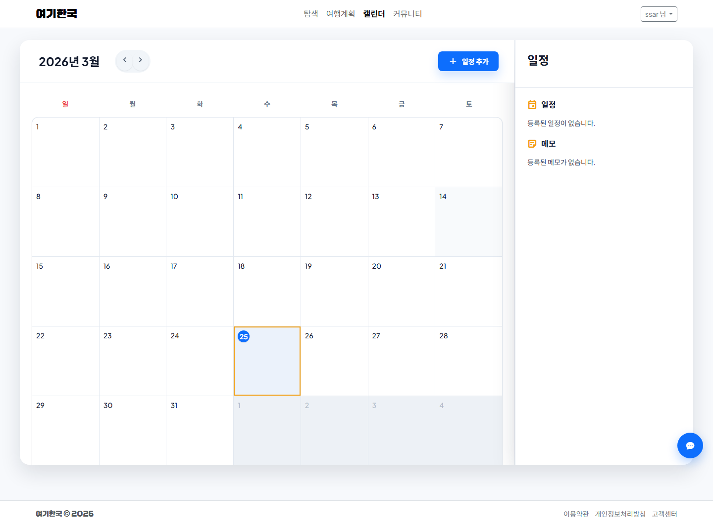
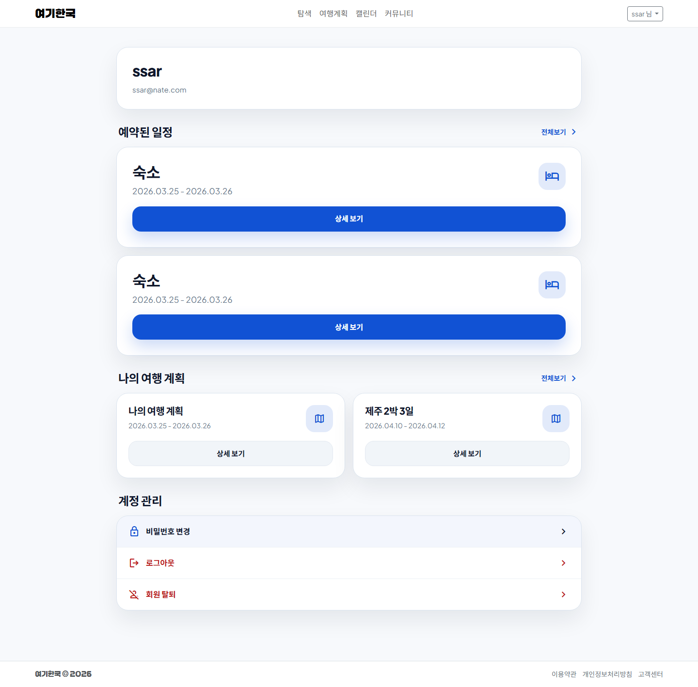

# 여기 한국

여행 계획, 지도 탐색, 숙소 예약, 일정 관리, 커뮤니티 기능을 하나의 흐름으로 연결한 통합 여행 플랫폼입니다. 사용자는 여행 계획을 만들고 날짜별 장소를 추가해 동선을 설계할 수 있으며, 지도 기반으로 관광지와 숙소를 탐색한 뒤 예약까지 이어서 진행할 수 있습니다.

- 실행 URL: `http://localhost:8080/`
- Test ID: `ssar@nate.com`, `admin@nate.com`
- Test PW: `1234`

## 프로젝트 소개

Travel Platform은 여행 준비부터 여행 후 기록까지의 과정을 한 서비스 안에서 연결하는 것을 목표로 만든 프로젝트입니다.

- `trip` 도메인에서 여행 계획 생성, 목록 조회, 상세 일정 관리를 지원합니다.
- `booking` 도메인에서 지도 기반 탐색, 숙소 선택, 예약 흐름을 제공합니다.
- `calendar`, `board`, `mypage`, `admin` 영역을 통해 일정 확인, 커뮤니티, 사용자 정보, 운영 기능을 함께 구성했습니다.
- Spring Boot + Mustache 기반 SSR 구조로 화면 렌더링과 서버 비즈니스 로직을 일관되게 관리합니다.

## 팀원 구성

- 김해준
- 김지민
- 이승욱
- 한승완
- 이지윤

## 1. 개발 환경

- Frontend: Mustache, Bootstrap 5, Vanilla JavaScript, Custom CSS
- Backend: Java 21, Spring Boot 4.0.3, Spring MVC, Spring Validation, Spring Data JPA
- Database: MySQL, H2(Test), Redis
- Test: JUnit 5, Spring Test, Playwright
- Build Tool: Gradle
- 협업 도구: GitHub, GitHub Issues, GitHub Project, Notion
- 실행 환경: Localhost, `.env` 기반 설정 분리

## 2. 채택한 개발 기술과 브랜치 전략

### Spring Boot + Mustache

- 서버 사이드 렌더링 기반으로 페이지를 빠르게 구성하고, 인증 및 비즈니스 로직을 서버 중심으로 통합했습니다.
- `templates/pages`, `templates/partials` 구조로 화면 조각을 분리해 재사용성과 유지보수성을 높였습니다.

### Spring MVC + Validation + JPA

- Controller, Service, Repository 계층을 나누어 책임을 분리했습니다.
- 서버 단에서 입력값 검증을 일관되게 처리해 요청 안정성을 확보했습니다.
- JPA를 사용해 여행 계획, 장소, 예약, 게시글 등 주요 도메인 데이터를 객체 중심으로 다뤘습니다.

### Redis

- 세션 및 확장 가능한 캐시 구조를 고려해 Redis를 연결했습니다.

### Playwright

- 주요 화면 캡처 및 UI 확인 자동화를 위해 Playwright를 포함했습니다.

### 브랜치 전략

- `main`: 배포 기준 브랜치
- `develop`: 통합 개발 브랜치
- `feature/*`: 기능 단위 작업 브랜치

기능별 브랜치에서 작업 후 `develop`으로 병합하는 방식으로 운영합니다.

## 3. 프로젝트 구조

```bash
travel_platform
├─ build.gradle
├─ settings.gradle
├─ package.json
├─ README.md
└─ src
   ├─ main
   │  ├─ java/com/example/travel_platform
   │  │  ├─ _core
   │  │  ├─ admin
   │  │  ├─ board
   │  │  ├─ booking
   │  │  ├─ calendar
   │  │  ├─ chatbot
   │  │  ├─ mypage
   │  │  ├─ trip
   │  │  ├─ user
   │  │  └─ weather
   │  └─ resources
   │     ├─ application.properties
   │     ├─ db
   │     ├─ static
   │     │  ├─ css
   │     │  └─ js
   │     └─ templates
   │        ├─ pages
   │        └─ partials
   └─ test
      └─ java/com/example/travel_platform
```

## 4. 역할 분담

### 김해준

- 프로젝트 방향
- 문서 체계
- 리팩토링
- 마이페이지
- 챗봇

### 김지민

- 사용자 관리 기능
- 캘린더

### 이승욱

- 지도
- 날씨
- 사이트 이름 아버지

### 한승완

- 게시글
- 커뮤니티 파트 완수 담당

### 이지윤

- 로그인
- 회원가입
- 여행 계획
- SNS 로그인

## 5. 개발 기간 및 작업 관리

- 전체 개발 기간: 2026.02.26 ~ 2026.03.25
- 테스트 및 화면 보완: 2026.03.21 ~ 2026.03.25

### 작업 관리

- GitHub Issues로 작업 단위를 나누고 우선순위를 관리했습니다.
- GitHub Project로 진행 상태를 `Todo`, `In Progress`, `Done` 기준으로 추적했습니다.
- 기능 단위 브랜치와 PR 중심으로 변경 사항을 검토했습니다.
- 도메인별 테스트를 통해 회귀를 줄이는 방향으로 관리했습니다.

### 주요 기능

- 여행 계획 생성, 목록 조회, 상세 일정 확인
- 여행 장소 추가 및 날짜별 동선 관리
- 지도 기반 숙소/관광지 탐색
- 숙소 예약, 예약 상세, 예약 완료 흐름
- 캘린더 일정 확인
- 게시판 목록, 상세, 작성, 수정
- 마이페이지 및 관리자 화면 제공

## 6. Coding Convention

- Java 코드는 계층별 책임을 분리하고, Controller에는 요청 처리만 두고 비즈니스 로직은 Service에 배치합니다.
- 도메인별 패키지 구조를 유지하고, 공통 처리는 `_core` 아래에 둡니다.
- 템플릿은 `pages`와 `partials`로 분리하고 공통 조각을 재사용합니다.
- 정적 스크립트는 페이지별로 분리하고, 필요한 화면에만 연결합니다.
- 테스트는 기능 계약이 깨지기 쉬운 Controller, Service, Template 중심으로 추가합니다.
- 환경값은 코드에 하드코딩하지 않고 `.env` 또는 설정 파일로 분리합니다.

## 7. 페이지별 기능

### 메인

- 서비스 진입 화면
- 로그인 상태에 따라 헤더 및 접근 가능한 기능 구분


### 로그인 / 회원가입

- 사용자 인증
- 세션 기반 로그인 처리
- 기본 사용자 진입 흐름 제공


### 여행 계획

- 여행 계획 생성
- 여행 목록 조회
- 여행 상세 확인
- 여행 장소 추가



### 지도 탐색 / 예약

- 지역별 지도 탐색
- 숙소 및 관광지 조회
- 예약 정보 확인
- 예약 완료 처리


### 캘린더

- 일정 확인
- 여행 및 예약 정보 연계 확인



### 게시판

- 게시글 목록 조회
- 게시글 상세 조회
- 게시글 작성 및 수정


### 마이페이지

- 사용자 정보 확인
- 예약 및 여행 이력 확인



### 관리자

- 사용자 관리
- 게시글 관리
- 대시보드 확인


